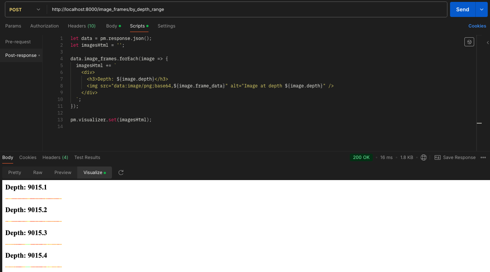

# Image Frame Processing API

## Purpose of the Assignment

This project is part of an assignment to demonstrate proficiency in computer vision, database management, and API development. The goal is to create a system that can process, store, and retrieve image frames efficiently, while applying image processing techniques.

## Problem Statement

Given a CSV file containing image data, the challenge is to:

1. Resize the image width from 200 pixels to 150 pixels.
2. Store the resized images in a database.
3. Create an API to request image frames based on a specified depth range.
4. Apply a custom color map to the generated frames.
5. Implement the solution in Python.
6. Containerize the solution for easy deployment.

## Solution Overview

This project implements a FastAPI-based web service that:

1. Reads image data from a CSV file.
2. Processes the image data by resizing and applying a color map.
3. Stores the processed images in a SQLite database.
4. Provides an API endpoint to retrieve image frames within a specified depth range.

The solution is containerized using Docker for easy deployment and scalability.

## Key Features

- CSV data analysis and processing
- Image resizing and color mapping
- Efficient database storage and retrieval
- RESTful API for accessing image frames
- Docker containerization

## Project Structure

```
.
├── custom_logger/
│   ├── __init__.py
│   └── helper.py
├── data/
│   ├── raw/
│   │   └── image_data.csv
│   └── processed/
│       └── image_data.db
├── database/
│   ├── __init__.py
│   └── helper.py
├── image_processing/
│   ├── __init__.py
│   └── helper.py
├── utilities/
│   ├── __init__.py
│   ├── constants.py
│   └── helper.py
├── main.py
├── Dockerfile
├── docker-compose.yaml
├── requirements.txt
└── README.md
```

Check README files under each of the folders for detailed information about the modules and functionalities.

## Setup and Installation

### Prerequisites

- Docker
- Docker Compose
- Anaconda (to run locally)

### Local Setup

1. Clone the repository:

   ```
   git clone https://github.com/di37/image-frame-processing-api.git
   cd image-frame-processing-api
   ```

2. Create and activate a Conda environment:

   ```
   conda create -n image_frame_processing_api python=3.12
   conda activate image_frame_processing_api
   ```

3. Install dependencies:

   ```
   pip install -r requirements.txt
   ```

## Running the Application

#### Locally

Run the FastAPI server:

```
python main.py
```

#### Using Docker

Build and run the Docker container:

```
docker-compose up --build
```

## API Usage

### Retrieve Image Frames

**Endpoint:** `POST /image_frames/by_depth_range`

**Request Body:**

```json
{
  "depth_min": 9015.1,
  "depth_max": 9015.4
}
```

**Response:**

```json
{
  "image_frames": [
    {
      "depth": 9015.1,
      "frame_data": "iVBORw0KGgoAAAANSUhEUgAAAJYAAAABCAIAAACzAMBOAAAA0klEQVR4nDXQTWfDYADA8d+sZISGhI6HlZSwHnbYrey4T7zL7t25hx5KWekOpbOSEBYanthO+QT/l5u/NwZq1pwI5JQ8E4ic6SjJaNmwoyUycGTCksiFFqSkzCm5o2bPCUQmzIi0BCoCW95H+jdTFjzSsCGlomBGRkfCE/jkgz01F3oeKLjS09GRjZQpaDhTM5AzH33OXMiIHGiIJBSjZ84XB1qWvLAismdNz4ojW4qxekHgh5TAABJSMhIGWmp6Mq40dOMo3NITeKUisuOXe0oK/5LxTNgeVdoEAAAAAElFTkSuQmCC"
    },
    {
      "depth": 9015.2,
      "frame_data": "iVBORw0KGgoAAAANSUhEUgAAAJYAAAABCAIAAACzAMBOAAAA50lEQVR4nE3RMUsCAQBA4U8yTjrJUjrpBodAMDAwdGvoXzcEbQ0NDoJCg8OhwQWCoqFxRye2JPQD3hveKx1e2TFnRALaDOgROZSVFmTEfgKnn7wxYUNAmTk5MRk5IRtSysS0iMhIGPmewlnELQErOtxTZ8QLISEr6twQE5ATUSOla/Z4dblfnxT7cXB3Yd1JZp4YkTJn949CTkZITI8GS1akJGxpMqBDhSljYgompBQ0qHHOgDYfvLM4Crs02fLMjgcmDIkoWBwLzKlyDfZkoAIyvkhBn5wpITUwZHI80qdFQcKS6l+WX/DJUb4sZ5DCAAAAAElFTkSuQmCC"
    },
    {
      "depth": 9015.3,
      "frame_data": "iVBORw0KGgoAAAANSUhEUgAAAJYAAAABCAIAAACzAMBOAAAA80lEQVR4nE3QsUoCAQCA4S8KLjrkQMFIMEgQtKWLHISI9oaWnqAX6Vnca60haGp1KIgMDhwMxA4S1C4yTmoSfIPv/9f+rggpk5GR06TJgIyITzJCIiL6JEyp0yAlIWFOkZgxD6BESEDOlCEJKBKBjJg6E0JK5MzJiSizZ9SKHp282i+YXbh5V+24LJjtGP4K1i22fRzpHrwlbnkh5WepHZISkbNBmzpfK2AEoMYpA+4oE5IyYExESJFz2vRI+KQEesScMWTXc1wvmNWeRu7JaHBISJdgWZoyps+YypI3AC0ykpUtHd/Xto6J2aRKhYwJCwIC/8V0VafEUGzlAAAAAElFTkSuQmCC"
    },
    {
      "depth": 9015.4,
      "frame_data": "iVBORw0KGgoAAAANSUhEUgAAAJYAAAABCAIAAACzAMBOAAABBElEQVR4nDXQQStDAQDA8Z+eZVlaTV68IqOV1RzUasrBzY3v4OTg86y47e6mHB0ciUKKWkzRUyuvHqatvcVpH+B/+P0n/nZZoU5Iny4VlrimA3qgQEiJHgkxVeqk3HIBamwRc8KAAuiDPH06ZOTJmKTAJmU6LLJNQjoOJ4ncrVVa9u+tRz4ONWPRsYMZ36uep/0iMFr22nBZuX53wwtvBEQ8jjkjUhZZIqM9pk0xIqbEHglnFAnpEZNQokjEHjUeaJMSknDKJgfkDdecF7czQcPVXPNHyo6vjdxvMD3/lAoMQ7kBMW0e+KRKyGA8eYEuXer+6rJArsUR65TpUqbKLD/0GME/18xZpDKHt9oAAAAASUVORK5CYII="
    }
  ]
}
```

To visualize the image frames directly in Postman:

1. Send a POST request to the `/image_frames/by_depth_range` endpoint.
2. In the Postman interface, go to the "Scripts" tab.
3. Under "Post-response", add the following script:

   ```javascript
   let data = pm.response.json();
   let imagesHtml = "";

   data.image_frames.forEach((image) => {
     imagesHtml += `
      <div>
         <h3>Depth: ${image.depth}</h3>
         
      </div>
   `;
   });

   pm.visualizer.set(imagesHtml);
   ```

4. Send the request and switch to the "Visualize" tab in the response section.
5. You should now see the image frames rendered with their corresponding depth values.



This script processes the JSON response, creates HTML for each image frame, and uses Postman's visualizer to display the images.

## License

This project is licensed under the MIT License - see the `LICENSE.md`.
