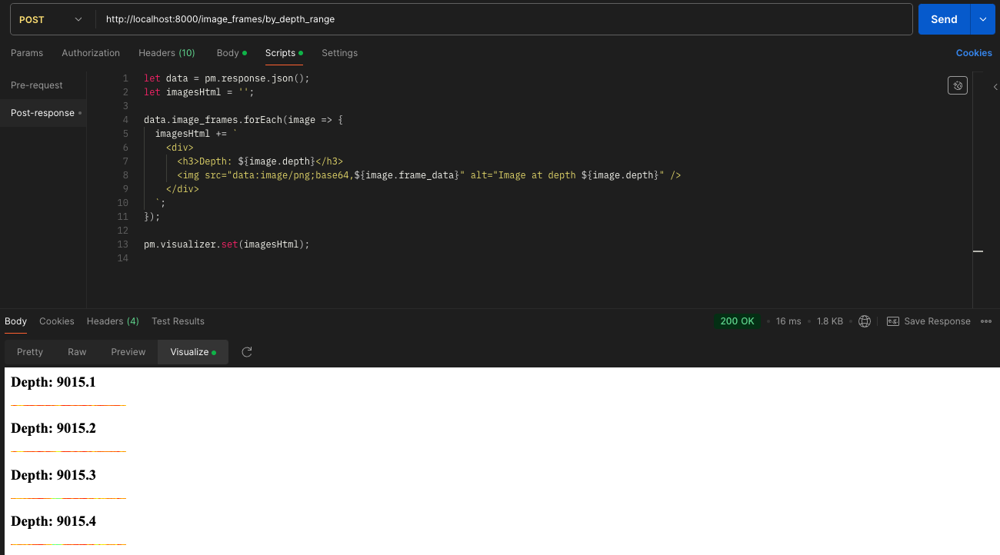

# Service Folder - `service`

This folder contains the FastAPI application and API endpoints for the project.

## Contents

- `__init__.py`: Exports the FastAPI app
- `app.py`: Defines the FastAPI application and API endpoints

## API Usage

### Retrieve Image Frames

**Endpoint:** `POST /image_frames/by_depth_range`

**Request Body:**

```json
{
  "depth_min": 9015.1,
  "depth_max": 9015.4
}
```

**Response:**

```json
{
  "image_frames": [
    {
      "depth": 9015.1,
      "frame_data": "iVBORw0KGgoAAAANSUhEUgAAAJYAAAABCAIAAACzAMBOAAAA0klEQVR4nDXQTWfDYADA8d+sZISGhI6HlZSwHnbYrey4T7zL7t25hx5KWekOpbOSEBYanthO+QT/l5u/NwZq1pwI5JQ8E4ic6SjJaNmwoyUycGTCksiFFqSkzCm5o2bPCUQmzIi0BCoCW95H+jdTFjzSsCGlomBGRkfCE/jkgz01F3oeKLjS09GRjZQpaDhTM5AzH33OXMiIHGiIJBSjZ84XB1qWvLAismdNz4ojW4qxekHgh5TAABJSMhIGWmp6Mq40dOMo3NITeKUisuOXe0oK/5LxTNgeVdoEAAAAAElFTkSuQmCC"
    }
    // ... other frames ...
  ]
}
```

To visualize the image frames directly in Postman:

1. Send a POST request to the `/image_frames/by_depth_range` endpoint.
2. In the Postman interface, go to the "Scripts" tab.
3. Under "Post-response", add the following script:

   ```javascript
   let data = pm.response.json();
   let imagesHtml = "";

   data.image_frames.forEach((image) => {
     imagesHtml += `
      <div>
         <h3>Depth: ${image.depth}</h3>
         
      </div>
   `;
   });

   pm.visualizer.set(imagesHtml);
   ```

4. Send the request and switch to the "Visualize" tab in the response section.
5. You should now see the image frames rendered with their corresponding depth values.



This script processes the JSON response, creates HTML for each image frame, and uses Postman's visualizer to display the images.
